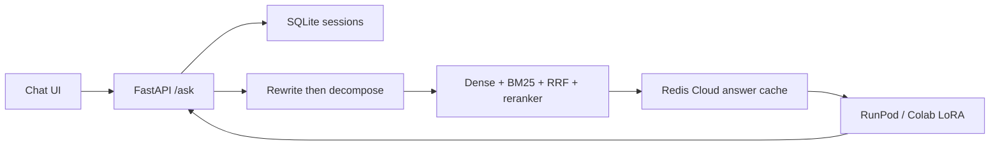

# Onboarding RAG Engine


Hybrid retrieval (dense + BM25 + RRF + cross-encoder + entity boost) feeds a QLoRA-tuned Llama 3.1 8B that answers with citations or abstains when the corpus does not support the claim.

## Architecture



**Frozen scope for the portfolio sprint:** no MongoDB, Slack bots, related-page expansion, extra fine-tuning, or new retrieval research.

## Features
- Conversational rewrite (follow-ups → standalone queries) + multi-query decomposition
- Intent-aware hybrid retrieval over ChromaDB v3
- Redis answer cache keyed by query + chunk IDs + cache/model/prompt version
- Remote generation with retries/backoff; partial multi-query failure handling
- FastAPI product API + minimal citation-aware chat UI
- Evaluation dataset + runner (Recall@k / MRR / citations / abstention / latency / cache)
- Unit tests + marked integration tests

## Quick start (local CPU + remote GPU)

### 1. Secrets
```bash
cp .env.example .env
# Fill GROQ_API_KEY, INFERENCE_URL, REDIS_URL (optional)
# Rotate any previously exposed keys before publishing the repo
```

### 2. Install
```bash
python -m venv .venv
# Windows: .venv\Scripts\activate
pip install -r requirements-dev.txt
```

### 3. Retrieval artifacts (gitignored)
Place or rebuild:
- `enterprise_data/chroma_db_v3/` — Chroma persistent DB
- `enterprise_data/bm25_index.pkl` — rebuild with aligned tokenizer:

```bash
python -m ingestion.bm25_ingestion
```

### 4. Start API + UI
```bash
# Requires INFERENCE_URL pointing at Colab/RunPod /generate
uvicorn api.app:app --host 0.0.0.0 --port 8000
```
Open http://127.0.0.1:8000

### 5. CLI
```bash
python -m inference.rag_engine "What arguments does HTTPException take?" -v --backend remote
python -m inference.rag_engine "..." --new-session --session-id <id>
```

## API
| Method | Path | Purpose |
|---|---|---|
| `POST` | `/sessions` | Create session |
| `POST` | `/ask` | `{question, session_id?, bypass_cache?}` |
| `GET` | `/health` | Retrieval / Redis / generation readiness |

Example:
```bash
curl -s http://127.0.0.1:8000/sessions -X POST
curl -s http://127.0.0.1:8000/ask -H "Content-Type: application/json" \
  -d "{\"question\":\"What arguments does HTTPException take?\",\"session_id\":\"...\"}"
```

## Evaluation
```bash
python -m evaluation.runner --retrieval-only
python -m evaluation.runner --base-url http://127.0.0.1:8000
python -m evaluation.runner --local   # full e2e (needs Groq + GPU endpoint)
```
Results write to `evaluation/results/latest.json`. Dataset: `evaluation/dataset.json`.

## Tests
```bash
pytest -m "not integration"
pytest -m integration   # needs corpus / INFERENCE_URL
```

## Docker (CPU API/UI)
```bash
docker compose up --build
```
Mounts `./enterprise_data` into the container. Generation still uses `INFERENCE_URL`.

## Deployment
- **CPU app:** any container host (Fly.io, Render, Railway, Cloud Run). See `docs/DEPLOY.md`.
- **GPU LoRA:** `deploy/runpod/` (preferred for interviews) or `deploy/colab/` (free/dev).
- Protect the generation server with `INFERENCE_API_KEY` and set the same value in the app `.env`.

## Model card
See [`MODEL_CARD.md`](MODEL_CARD.md). Interview talking points: [`docs/INTERVIEW_BRIEF.md`](docs/INTERVIEW_BRIEF.md).

## Repository layout
```
api/                 FastAPI + static chat UI
inference/           Orchestration, rewrite, decompose, cache, sessions
retrieval/           Hybrid retrieval
ingestion/           BM25 index builder
evaluation/          Benchmark dataset + runner
tests/               pytest unit + integration
deploy/colab|runpod  GPU serve scripts
Fine-tuning/         Training / dataset research (not required to serve)
```

## Security
- `.env` is gitignored; only `.env.example` is tracked
- Never log API keys or Redis URLs
- Rotate Groq / Redis / cloud tokens if they were ever committed or pasted into chat

## Limitations (honest)
- GPU cost and cold starts (Colab ngrok / RunPod)
- Corpus coverage ≠ all of FastAPI
- Rewrite/decompose quality depends on Groq
- Demo is optimized for interview scenarios, not multi-tenant production SLA

## Future work
Deliberately deferred to protect the working demo — see [`docs/FUTURE_WORK.md`](docs/FUTURE_WORK.md):
- Related-page expansion in retrieval (graph-hop over chunk relationships)
- Corpus sync with GitHub (on-demand refresh script → scheduled sync)

## License / attribution
Educational portfolio project. FastAPI names and docs concepts belong to their respective owners.
