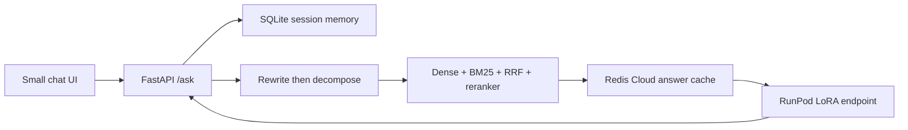
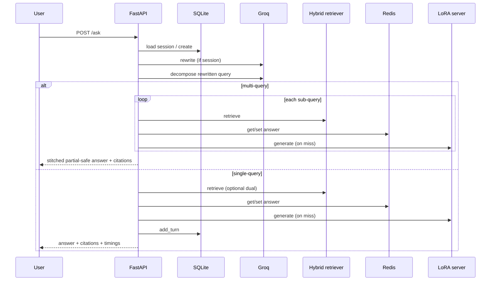

# Architecture diagrams

## System context



## Ask sequence



## Cache keying

```
sha256(CACHE_VERSION | model_version | prompt_version | normalized_query | chunk_ids)
```

Stale answers invalidate when corpus chunk IDs change or versions bump.
